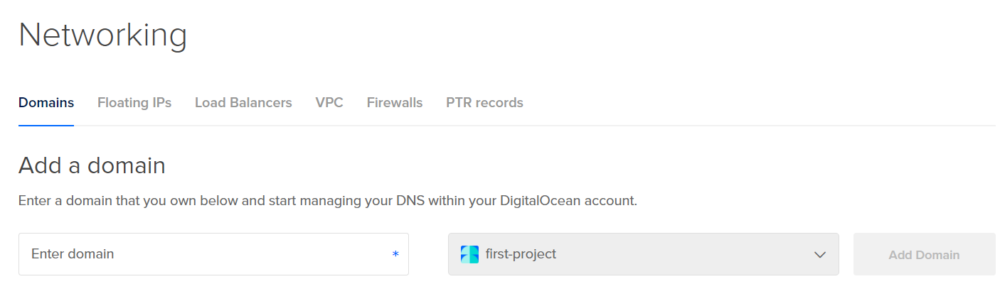
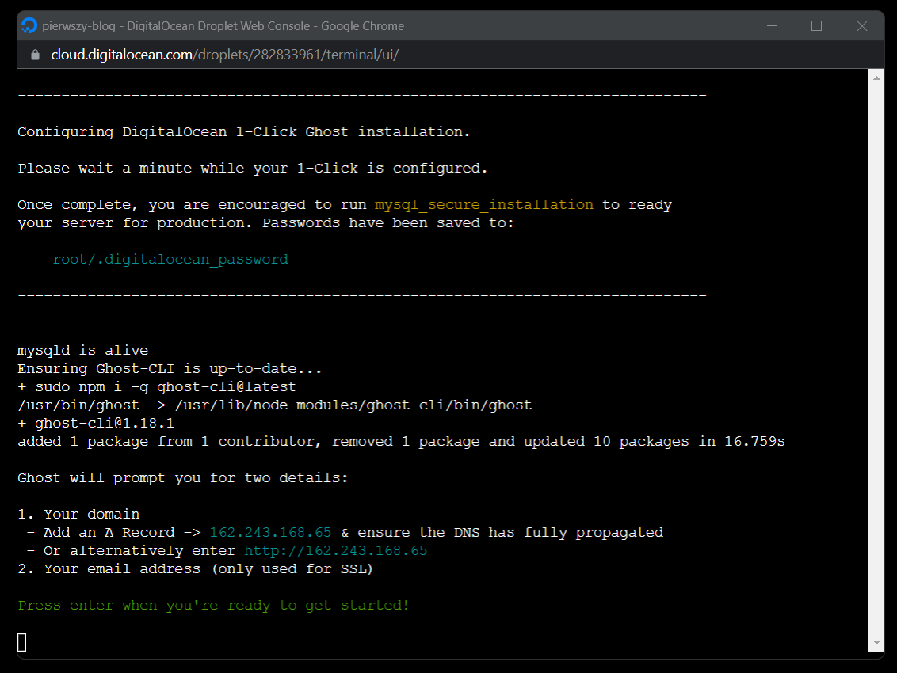

## Czego się nauczysz:

1. Instalacja platformy Ghost na Digital Ocean
2. Dodanie domeny i konfiguracja rekordów
3. Instalacja i konfiguracja Let's Encrypt (SSL) dla domeny
4. Przekierowania 301 w nginx

## Wstęp

Ghost jest prostą platformą blogową rozwijaną jako Open Source. Platforma ta pracuje na Node.js, dlatego nie możemy jej
zainstalować na tym samym hostingu co Word Press.

Mamy dwa wyjścia.

Możemy skorzystać z oferty na stronie [Ghost.org](https://ghost.org/pricing/) gdzie, wykupując konkretny pakiet w
opłacie miesięcznej, będziemy mogli prowadzić bloga, nie przejmując się utrzymaniem i konserwacją własnej maszyny
wirtualnej z serwerem. Jest to opcja dość droga.

Innym wyjściem jest instalacja na własnym serwerze, wybierając popularnego dostawcę jak Azure, AWS, Google Cloud
Platform czy właśnie Digital Ocean. Wybrałem tą ostatnią opcję z powodu niskiej ceny w granicach 5$ miesięcznie i
instalacji typu 1-Click z gotowego obrazu z platformą Ghost dostępną w Marketplace Digital Ocean. Niestety idea 1-Click
nie jest do końca prawdą i potrzeba trochę więcej wysiłku, żeby skonfigurować nasz serwer.

Poniżej przedstawiam cały proces instalacji wraz z darmowym SSL dla domeny i przekierowaniem z www na bez www lub na
odwrót.

## Link afiliacyjny

Digital Ocean ma program afiliacyjny. Jeżeli założysz konto z mojego linka,
otrzymasz $100 na 60 dni. Jeżeli dalej będziesz używał Digital Ocean i wydasz własne 25$, to ja również dostanę 25$ na
konto Digital Ocean i koszty chmury. Jeżeli jesteś gotów, to kliknij i załóż konto:

[](https://www.digitalocean.com/?refcode=7d5a8e658651&utm_campaign=Referral_Invite&utm_medium=Referral_Program&utm_source=badge)

Jeżeli skorzystałeś z linka to wielkie dzięki!

## Co potrzebujesz

1. Pomysł na bloga ;-)
2. Domenę
3. Konto na Digital Ocean
4. Własny klucz ssh

## Klucz ssh

Do obsługi Digital Ocean warto mieć swój klucz SSH. Musisz dodać swój publiczny klucz SSH do konfiguracji swojego konta
w Digital Ocean. Przeprowadzi Cię przez to
ta [instrukcja](https://docs.digitalocean.com/products/droplets/how-to/add-ssh-keys/to-account/).

Jeżeli nie masz klucza SSH możesz też w czasie instalacji platformy Ghost skorzystać z konfiguracji zwykłego hasła o
czym będę pisał w punkcie instalacji.

Inna opcja to wykorzystanie terminala przez przeglądarkę. W Digital Ocean możemy otworzyć dodatkowe okno przeglądarki,
które będzie połączone z naszym serwerem. Działa to trochę wolno ale jest to wygodny i szybki terminal.

## Dodanie domeny

Jeżeli chcesz założyć bloga na platformie Ghost, na pewno masz już swoją domeną. Musisz ją przekierować na DNS-y Digital
Ocean. W menu *Networking* i zakładce *Domains* możesz przypisać domeną do projektu.


W tym przypadku dodaję domenę do projektu o nazwie *first-project*. Ponieważ wszystkie zasoby rozdzielamy do konkretnych
projektów. W tym przypadku jest to projekt bloga na platformie Ghost.

Gdy dodamy domenę, będziemy widzieli pierwsze rekordy DNS:


Sprawdź dokładnie jakie ty masz adresy DNS przypisane do domeny, bo mogą pojawić się różnice. Kolejne zadanie to
przekierowanie domeny na te rekordy DNS. Musisz to zrobić u swojego operatora domeny. Ponieważ każdy operator ma różne
sposoby na konfigurację domeny, ciężko mi pomóc w tym zdaniu.

Gdy zmienisz DNS dla swojej domeny, będziesz musiał odczekać nawet kilka godzin, aż zauważysz efekt przekierowania na
serwery DNS. Czasami trwa to kilka, a czasami kilkanaście godzin. W moim przypadku musiałem czekać do następnego dnia.
Może się więc okazać, że musisz wrócić do tego poradnika za kilka godzin :-).

## SSL dla domeny

Certyfikaty SSL dla domen są zazwyczaj płatne. Ghost wykorzystuje darmowe certyfikaty z Let's Encrpt. Każdy może je
używać, jedyną ich wadą jest to, że trzeba je odnawiać co 3 miesiące. Ghost ma wbudowany mechanizm automatycznego
odnawiania. Działa to na zasadzie skonfiguruj i zapomnij. Więcej poczytasz [tutaj](https://letsencrypt.org/).

## Instalacja Ghost z gotowego obrazu

Gdy mamy już podpiętą domenę w Markecie Digital Ocean znajdziemy gotowy obraz z platformą Ghost pod
tym [linkiem](https://marketplace.digitalocean.com/apps/ghost). Instalacja gotowego obrazu załatwia za nas mnóstwo
rzeczy. Ja sam nie jestem specjalistą w serwerach i linuksach dlatego skorzystanie z takiego obrazu jest świetnym
wyjściem. Obraz zapewnia instalację:

- platformy Ghost
- serwera Nginx
- bazy danych MySQL
- Node.js
- oraz mnóstwo innych konfiguracji, o których pewnie nie mam pojęcia.

Klikamy w przycisk **Create Ghost Droplet** po czym przenosimy się na stronę konfiguracji serwera. Wybieramy najtańszą
konfigurację:

- w sekcji *Choose a plan* wybieramy: *Basic*
- w sekcji *CPU options* wybieramy: *Regular Intel with SSD*
- później wybieramy najtańszy serwer *$5/mo* w konfiguracji: *1GB / 1CPU, 25 GB SSD Disk, 1000 GB transfer*
  

W sekcji *Choose a data center region* wybieramy region najbliżej naszych czytelników bloga.

Kolejna sekcja konfiguracji, jaka nas interesuje to wybór sposobu Autentykacji przy logowaniu się do serwera. Ja
wybrałem SSH keys. Jeżeli nie jesteś obeznany z tematem SSH, to możesz też zdecydować się na logowanie za pomocą hasła.


Na końcu warto jeszcze dodać nazwę dla naszego serwera. W sekcji *Select Project* wybieramy ten projekt, do którego
przydzieliliśmy naszą domenę.


Wszystkie pozostałe konfiguracje są w zupełności dowolne. Jeżeli zależy Ci na bezpieczeństwie możesz jeszcze dodać kopię
Enable Backups. Gdy wszystko gotowe klikamy *Create Droplet*.

Przez pewien czas nas Droplet będzie się tworzył. Cały proces instalacji możemy podglądać:


## Dokończenie instalacji Ghost

Gdy zakończy się proces tworzenia z platformą Ghost, musimy dostać się do naszego serwera przez terminal.

Możemy wykorzystać terminal w naszym systemie operacyjnym lub nawet wykorzystać przeglądarkę i konsolę, którą zapewnia
nam Digital Ocean. Jest to opcja dla tych, którzy nie mają klucza SSH i już zapomnieli hasło do serwera:


Wchodząc do konfiguracji serwera, widzimy, że mamy opcję włączenia *Consoli*, która połączy się od razu z serwerem
bezpośrednio z przeglądarki:



Po pierwszym wejściu na serwer musimy chwilę poczekać, aż Ghost dokończ instalację. Po krótkiej chwili będziemy mieli do
wykonania dwa zadania.

Musimy skierować domeną na odpowiedni adres IP, który wskazany jest w terminalu:

Wracamy do administracji Digital Ocean w sekcji *Networking* i w zakładce *Domains*, klikamy na naszą domenę i
konfigurujemy nowy rekord dla domeny:


W okienku *HOSTNAME* wpisujemy znak *@*, który odnosi się do naszej domeny, a w okienku *WILL DIRECT TO* wybieramy nasz
serwer, który ma to samo IP widoczne w okienku terminala. Tworzymy nowy rekord.

Tworzymy jeszcze jeden rekord z opcją www. W okienku HOSTNAME wpisujemy *www* wybieramy ten sam serwer i tworzymy nowy
rekord.

Po tej całej konfiguracji, rekordy dla mojej domeny wyglądają tak:


Zadanie numer dwa jest bardzo proste, musisz mieć jakiś adres email, który podasz przy konfiguracji SSL.

Gdy wszystko gotowe, wracamy do terminala, który jest podłączony do naszego serwera i naciskamy ENTER. Zacznie się ostateczna instalacja i konfiguracja Ghost na Droplecie, przez dłuższy czas będziesz widział podobne komunikaty do tego:

```bash
✔ Checking system Node.js version - found v14.18.1
✔ Checking logged in user
✔ Checking current folder permissions
✔ Checking system compatibility
✔ Checking for a MySQL installation
✔ Checking memory availability
✔ Checking free space
✔ Checking for latest Ghost version
✔ Setting up install directory
☱ Downloading and installing Ghost v4.32.1 > Installing dependencies > [3/5] Fetching packages...
```

W pewnym momencie instalacja zakończy się i zapyta nasz o podanie adresu bloga:

```bash
? Enter your blog URL:
```

Wpisujemy domenę bloga, ja podają ją bez www:

```bash
? Enter your blog URL: zacznijprogramowac.net
```

Kolejne pytanie o adres email. Wpisz swój adres dla certyfikatu SSL:

```bash
? Enter your email (For SSL Certificate)
```

W przypadku tej konfiguracji certyfikat będzie wskazywał tylko na domenę bez www, czyli zacznijprogramowac.net

Gdy instalacja zakończy się, dostaniemy taki komunikat:

```bash
------------------------------------------------------------------------------

Ghost was installed successfully! To complete setup of your publication, visit: 

    https://zacznijprogramowac.net/ghost/


------------------------------------------------------------------------------

For any further commands, please switch to the ghost-mgr user to manage Ghost.

    sudo -i -u ghost-mgr

------------------------------------------------------------------------------


root@pierwszy-blog:~# 
```

Pierwsza informacja wskazuje adres do administracji naszym blogiem. Warto udać się tam jak najszybciej i dokończyć konfigurację, czyli założyć konto super admina, zanim ktoś zrobi to za nas.

Druga informacja to podpowiedź, że jeżeli chcemy, cokolwiek konfigurować w terminalu co dotyczy platformy Ghost, powinniśmy użyć polecenia:

```bash
sudo -i -u ghost-mgr
```

To polecenie przełącza nas na użytkownika ghost-mgr, który może zarządzać instalacją Ghost.

## Konfiguracja SSL dla przedrostka www

W tym momencie nasz blog obsługuje adres https://zacznijprogramowac.net/. Jeżeli będziemy chcieli wejść na ten adres z przedrostkiem www, to okaże się, że ten adres nie ma bezpiecznego połączenia SSL.

Musimy to dodatkowo skonfigurować. Gdy zalogujemy się do terminala, wykonujemy polecenie:

```bash
sudo -i -u ghost-mgr
```

i przechodzimy do miejsca instalacji Ghost:

```
$ cd /var/www/ghost/
```

Ghost zainstalowany jest wraz z narzędziem CLI, dlatego przez polecenie Ghost możemy konfigurować różne rzeczy. Więcej informacji znajdziesz [tutaj](https://ghost.org/docs/ghost-cli/).

My wykonujemy polecenie:

```bash
$ ghost config url https://www.zacznijprogramowac.net
```

Jeżeli wcześniej nie wykonałeś konfiguracji dla domeny z rekordem *www* to otrzymasz taki błąd:

```
One or more errors occurred.

1) Setting up SSL

Message: Uh-oh! It looks like your domain isn't set up correctly yet.
Because of this, SSL setup won't work correctly. Once you've set up your domain
and pointed it at this server's IP, try running `ghost setup ssl` again.
```

Jeżeli wszystko przeszło poprawnie, to otrzymasz taki komunikat:

```bash
Successfully set 'url' to 'https://www.zacznijprogramowac.net'
+ sudo systemctl is-active ghost_zacznijprogramowac-net
Ghost is running. Don't forget to run ghost restart to reload the config!
```

To polecenie skonfigurowało Ghost na domenę z przedrostkiem www. Wykonujemy kolejne polecenie:

```bash
ghost setup nginx ssl
```

Uruchamia to proces instalacji SSL dla tej domeny. Znowu musimy w tym czasie podać adres email. Po czasie otrzymamy informację, że wszystko się udało:

```bash
✔ Setting up SSL
```

Kolejnym krokiem jest powrót do adresu bez przedrostka www. W moim przypadku ja tak chcę używać adresu bloga, wpisuję więc polecenie:

```bash
ghost config url https://zacznijprogramowac.net
```

To jaki adres konfigurujemy za pomocą `ghost config` jest ważne dla platformy Ghost, która będzie odnosiła się do domeny w swojej konfiguracji. Natomiast nasz blog działa już pod adresem  www i bez www. Po wpisaniu do przeglądarki powinieneś widzieć zabezpieczony adres przez SSL dla przedrostka i bez przedrostka www.

## Konfiguracja przekierowania z www na bez www

Gdy mamy skonfigurowane certyfikaty dla www i bez www, możemy zająć się przekierowaniem. Ja chcę swojego bloga używać bez www.

Bardzo ważne jest to, aby mieć certyfikat SSL dla każdej wersji domeny. Gdybyśmy nie mieli certyfikatu dla www i chcieli zrobić przekierowanie na bez www, nie moglibyśmy tego zrobić. Przeglądarka blokowałaby to przekierowanie ponieważ wykryła by niebezpieczny adres bez HTTPS i do przekierowania nie doszłoby.

Musimy edytować dwa pliki konfiguracyjne serwera nginx.

Wchodzimy do katalogu:

```bash
cd /etc/nginx/sites-available
```

Po wpisaniu polecenia:

```
ls
```

widzimy pliki konfiguracyjne:

```bash
default  
zacznijprogramowac.net-ssl.conf  
zacznijprogramowac.net.conf  
www.zacznijprogramowac.net-ssl.conf  
www.zacznijprogramowac.net.conf
```

Ponieważ ja chcę przekierować stronę na bez www, to będę edytował te pliki, które zaczynają się od www.

Dla tych, którzy na co dzień nie posługują się terminalem i edytorem *vim* w terminalu, polecam doinstalowanie edytora *nano*, przez polecenie:

```bash
sudo apt install nano
```

Teraz możemy edytować pierwszy plik przez polecenie:

```bash
nano www.zacznijprogramowac.net.conf
```

Pierwszy plik dotyczy przekierowania po porcie 80. W sekcji `location /` dopisujemy odpowiedni kod:

`return 301 https://zacznijprogramowac.net$request_uri;`

Kod ten powinien znaleźć się na końcu bloku, tak wygląda cały zmodyfikowany plik:

```bash
server {
    listen 80;
    listen [::]:80;

    server_name www.zacznijprogramowac.net;
    root /var/www/ghost/system/nginx-root; # Used for acme.sh SSL verification (https://acme.sh)

    location / {
        proxy_set_header X-Forwarded-For $proxy_add_x_forwarded_for;
        proxy_set_header X-Forwarded-Proto $scheme;
        proxy_set_header X-Real-IP $remote_addr;
        proxy_set_header Host $http_host;
        proxy_pass http://127.0.0.1:2368;
		
		#tutaj dopisujemy przekierowanie
		return 301 https://zacznijprogramowac.net$request_uri;
    }

    location ~ /.well-known {
        allow all;
    }

    client_max_body_size 50m;
}
```

Ta linijka kody tworzy stałe przekierowanie 301 na adres bez przedrostka www.

Aby zapisać zmiany w edytorze *nano* naciskamy *Ctrl + O* i potwierdzamy zapis przez *Enter*. Aby wyjść z pliku, naciskamy *Ctrl + X*

Edytujemy kolejny plik:

```bash
nano www.zacznijprogramowac.net-ssl.conf
```

Tym razem jest to plik, który konfiguruje port 443:

```bash
server {
    listen 443 ssl http2;
    listen [::]:443 ssl http2;

    server_name www.zacznijprogramowac.net;
    root /var/www/ghost/system/nginx-root; # Used for acme.sh SSL verification (https://acme.sh)

    ssl_certificate /etc/letsencrypt/www.zacznijprogramowac.net/fullchain.cer;
    ssl_certificate_key /etc/letsencrypt/www.zacznijprogramowac.net/www.zacznijprogramowac.net.key;
    include /etc/nginx/snippets/ssl-params.conf;

    location / {
        proxy_set_header X-Forwarded-For $proxy_add_x_forwarded_for;
        proxy_set_header X-Forwarded-Proto $scheme;
        proxy_set_header X-Real-IP $remote_addr;
        proxy_set_header Host $http_host;
        proxy_pass http://127.0.0.1:2368;
        
        #tutaj dopisujemy przekierowanie
		return 301 https://zacznijprogramowac.net$request_uri;

    }

    location ~ /.well-known {
        allow all;
    }

    client_max_body_size 50m;
}
```

Analogicznie jak w poprzednim pliku, na końcu sekcji `location /` dodajemy przekierowanie 301. Zapisujemy plik przez *Ctrl + O* i potwierdzenie enterem i wychodzimy z *nano* przez *Ctrl + X*.

Przed nami dwa ostatnie zadania, pierwsze to sprawdzenie, czy pliki, które zmienialiśmy, są poprawne:

```bash
sudo nginx -t
```

To polecenie przeprowadza walidację serwera nginx. Jeżeli wszystko jest ok, zobaczymy taki komunikat:

```bash
nginx: the configuration file /etc/nginx/nginx.conf syntax is ok
nginx: configuration file /etc/nginx/nginx.conf test is successful
```

Jeżeli jest ok, to musimy zrestartować nginx przez polecenie:

```bash
sudo nginx -s reload
```

Od tego momentu jak nie wpiszemy nasz adres w przeglądarce zawsze będzie przekierowany na https://zacznijprogramowac.net/

Jeżeli chcesz, aby Twój blog działał z przedrostkiem www. Wszystko musisz zrobić analogicznie bardzo podobnie. Zmiany dotyczyć będą natomiast tylko plików bez www, czyli:

```
zacznijprogramowac.net-ssl.conf  
zacznijprogramowac.net.conf  
```

a przekierowanie będzie na przedrostek www:

```bash
return 301 https://zacznijprogramowac.net$request_uri;
```

## Podsumowanie

I to tyle w tym wpisie. Mam nadzieję, że niczego nie pominąłem. Jak widzicie, instalacja bloga na platformie Ghost reklamowana jako 1-Click nie do końca jest prawdą. Czeka nas trochę konfiguracji. Niezbędna jest też minimalna wiedza w zakresie serwerów, obsługi consoli, kluczy ssh, certyfikatów ssl i wielu innych drobnostek. Kolejny temat, który wydaje się prosty, dopóki nie zaczniemy grzebać.

Jeśli chcesz coś dodać lub poprawić to zapraszam do zostawienia komentarza.