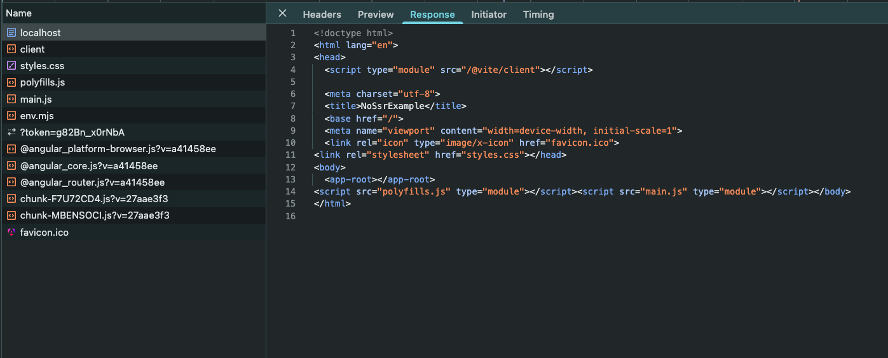

## Szybka odpowiedź

CSR - Client-Side Rendering to renderowanie strony / aplikacji po stronie przeglądarki. W odpowiedzi na zapytanie
serwer przesyła pliki JavaScript, HTML i CSS do przeglądarki. W tym czasie przeglądarka buduje
całą strukturę strony na podstawie otrzymanego pliku HTML i CSS, czyli obiekt DOM (Document Object Model). Następnie
wykonuje kod JavaScript, zapewniając interakcje na stronie oraz pobiera wszystkie potrzebne dane z serwera. W ten sposób
działa większość popularnych frameworków jak Angular, React czy Vue. CSR jest przeciwieństwem SSR, czyli Server-Side
Rendering

## CSR w dalszych szczegółach

Ponieważ wszystko dzieje się po stronie przeglądarki, niezbędna jest obsługa JavaScript. W przypadku wyłączonego
JavaScript strona może nie załadować się, a jej obsługa nie będzie możliwa. Taka sytuacja może wydawać się dziwna,
ale czasami zdarzają się wymagania klientów, aby strona działa bez obsługi JavScript. Implementacja z CSR może być tutaj
niemożliwa.

W przypadku CSR mamy też możliwość podglądania zapytań do serwera czy innych zewnętrznych API w przeglądarce.
Czasami pozwala nam to na kontrolowanie zapytań HTTP i otrzymywanych danych, szczególnie pomocne podczas developmentu
i debugowania aplikacji.

## Korzyści CSR

- łatwiejsza implementacja w porównaniu do SSR
- większa interaktywność strony, brak efektu ładowania strony
- mniejsze obciążenie serwera

## Wady CSR

- bardzo słabe SEO i trudne do zaimplementowania
- dłuższy czas pierwszego ładowania strony
- większe obciążenie przeglądarki

## Kiedy warto użyć CSR

Gdy zależy nam na dużej interaktywności strony, głównie dla aplikacji SPA - Single Page Application. Użytkownik
otrzymuje natychmiastowy feedback po każdej wykonanej akcji. Przeglądarka sama pobiera dane z serwerów i podmienia
treści na stronie. Nie widzimy efektu ładowania strony, a często tylko zmieniające się treści.

Ponieważ implementacja jest łatwiejsza niż w przypadku SSR, zawsze warto używać CSR, gdy nie zależy nam na SEO. Dotyczy
to wszelkiego rodzaju aplikacji internetowych jak giełdy, brokerzy, banki, panele admina czy programy do faktur. CSR
raczej nie sprawdzi się przy sklepach internetowych, gdy chcemy aby każda podstrona dobrze działała w ramach SEO.

## Jak wygląda CSR w przeglądarce

### Angular z CSR

Poniżej jest przykład pobierania strony z renderowaniem CSR. W przeglądarce w zakładce Preview nie widzimy żadnych
elementów strony. Przeglądarka otrzymała tylko podstawowy plik HTML wraz z plikami CSS i JavaScript. Minie jeszcze
chwila, zanim przeglądarka wyrenderuje kompletną stronę i przedstawi ją użytkownikowi.

W Widoku "Preview" mamy pustą stronę:

## Podsumowanie

- CSR to renderowanie strony po stronie przeglądarki na podstawie otrzymanych plików HTML, CSS i JavaScript z serwera
- pierwsze ładowanie strony jest dłuższe
- interakcje na stronie są szybsze i bardziej "przyjazne" dla użytkownika
- CSR nie nadaje się do stron / aplikacji gdzie SEO jest bardzo istotne
