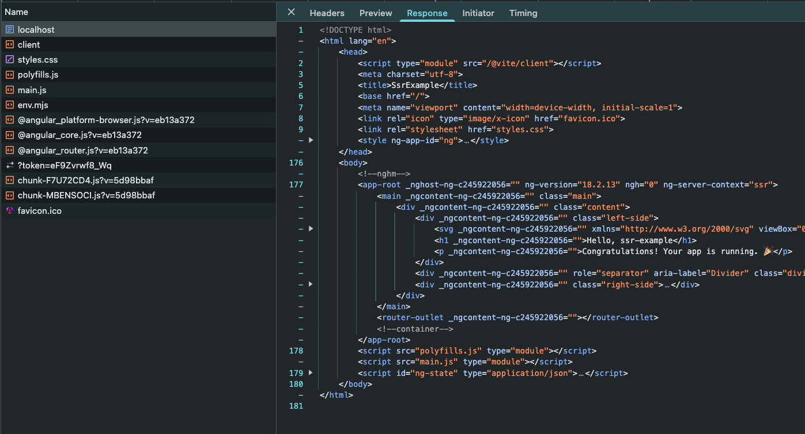
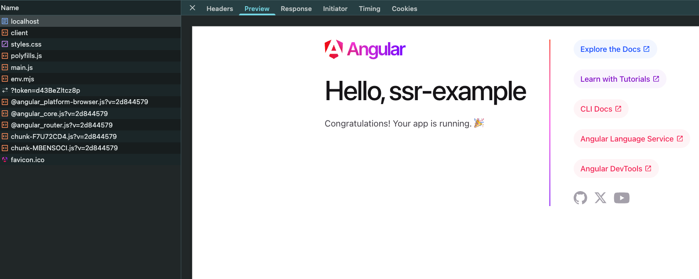
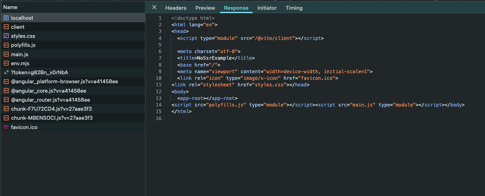

## Szybka odpowiedź

SSR - Server-Side Rendering to renderowanie strony/aplikacji po stronie serwera i przesłaniu gotowego pliku HTML
wypełnionego treścią do przeglądarki, który jest gotowy do wyświetlenia. Przygotowanie statycznego pliku HTML może 
wiązać się z pobraniem treści z bazy danych czy innych serwisów, przygotowaniem stylów CSS, przygotowaniem plików
JavaScript. Wszystkie te kroki są wykonane po stronie serwera, aby przesłać gotową stronę do przeglądarki.
Celem SSR jest szybsze wyświetlenie strony i poprawa SEO.

## SSR w dalszych szczegółach

Przygotowany statyczny plik HTML z treścią, wysyłany jest do przeglądarki. Użytkownik nie czeka zatem, aż przeglądarka
przetworzy cały kod jak w przypadku renderowania CSR - Client-Side Rendering. Przeglądarka otrzymuje od razu gotowy HTML
do wyświetlenia. Poprawia to znacznie czas, jaki mija od wysłania zapytania na serwer do czasu wyświetlenia strony w
przeglądarce.

Przeglądarka otrzymuje gotowy, ale statyczny plik HTML. Strona prezentuje tylko treść, w tym momencie nie działają na
niej interaktywne elementy jak przyciski, menu etc. Ostatnią rzeczą jest obsługa interaktywności strony, czyli obsługa JavaScript.
Kod JavaScript jest przesłany do przeglądarki wraz z plikiem HTML. Zadaniem przeglądarki jest uruchomienie kodu
JavaScript, który odpowiada za interaktywność strony. Proces ten nazywamy hydracją, o czym będzie inny wpis.

## Korzyści SSR

* szybsze ładowanie strony
* lepsze SEO
* lepsze [Core Web Vitals](https://web.dev/explore/learn-core-web-vitals?hl=pl); wskaźniki jakości strony
* renderowanie nie zużywa zasobów naszego komputera ;)

## Wady SSR

* renderowanie odbywa się po stronie serwera, zużywa zasoby serwera
* implementacja takiej strony może być bardziej skomplikowana
* w zależności od frameworka SSR może działać inaczej, nie ma tutaj standardu

## Kiedy warto użyć SSR

Przede wszystkim, gdy zależy nam na szybkości działania strony oraz pozycjonowaniu w
wyszukiwarce (SEO). Dotyczy to przede wszystkim typowych stron internetowych. W przypadku tworzenia zamkniętych
aplikacji, jak oprogramowanie do faktur, panel administracyjny czy inne wewnętrzne aplikacje SSR może być całkowicie
zbędny, będzie niepotrzebną komplikacją.

## Jak wygląda SSR w przeglądarce

### Angular z SSR

Przykłądem jest tutaj aplikacja Angulara wygenerowana z SSR. W czasie tworzenia aplikacji można zdecydować się na
włączenie SSR, jak i dodać SSR później.

Poniżej widzimy, że po wywołaniu aplikacji w przeglądarce otrzymujemy gotowy HTML (część kodu jest zwinięta dla
zwięzłości):

Dodatkowo w widoku "Preview" zobaczymy co wyrenderował serwer:

### Angular bez SSR

Poniżej jest przykład tej samej aplikacji, ale bez SSR. Widać że otrzymujemy jedynie niezbędny kod HTML z podpiętymi
plikami CSS i JavaScript, które przeglądarka musi teraz przetworzyć i wyrenderować dla użytkownika:

W Widoku "Preview" mamy pustą stronę:

## Podsumowanie

*   SSR to renderowanie strony po stronie serwera i przesłanie gotowego pliku HTML do przeglądarki
*   SSR pozwala na szybsze ładowanie strony, co poprawia komfort użytkownika i SEO.
*   Implementacja SSR może być bardziej skomplikowana i wymaga zasobów serwera.
*   SSR jest szczególnie przydatny dla stron internetowych, na których zależy nam na szybkości i pozycjonowaniu.
*   Wybór między SSR a CSR zależy od konkretnych potrzeb i wymagań projektu.

