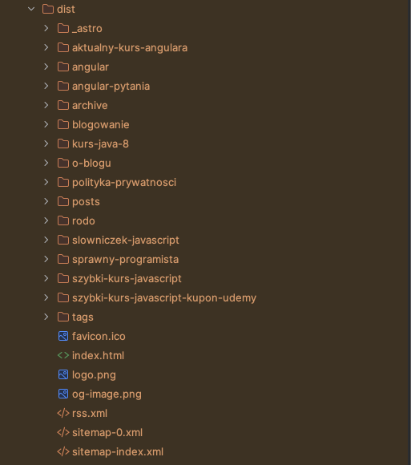

## Szybka odpowiedź

SSG - Static-Site Generation to generowanie stron HTML podczas procesu budowy naszego kodu. Wygenerowane w ten sposób
statyczne pliki HTML tworzą w całości naszą stronę, którą przesyłamy na serwer. Użytkownik, wykonując zapytanie o naszą
stronę, od razu dostaje gotowy HTML do wyświetlenia bez żadnego dodatkowego renderowania po stronie serwera.

## SSG w dalszych szczegółach

Możemy to porównać do "ręcznego" tworzenia stron internetowych bez użycia frameworków jak Angular, React czy Vue.
Wynikiem naszej pracy byłyby powiązane ze sobą pliki HTML z elementami CSS i JavaScript. Tak stworzoną stronę możemy
wrzucić na najprostszy serwer, który uruchomi nasz plik index.html i pozwoli wyświetlić stronę w przeglądarce.

Obecnie istnieje wiele frameworków, które pomagają tworzyć strony SSG jak Jekyll, Hugo, Next.js czy Astro. Ten blog,
stworzony jest w Astro. Po uruchomieniu komendy `npm run build` blog zostaje wygenerowany jako statyczne pliki html
i jest gotowy do przesłania na serwer:

Na pewno warto skorzystać z jednego z wielu frameworków, z którymi tworzenie stron SSG jest o wiele prostsze.

Jeżeli chcemy porównać SSG i SSR to:

- strony SSG renderowane są podczas budowania kodu i gotowa strona jest wysłana na serwer
- strona SSR jest renderowana na serwerze dla każdego zapytania użytkownika

## Korzyści SSG

- bardzo szybkie ładowanie strony w przeglądarce, serwer nie musi nić renderować, strona od razu jest wyświetlana
- bardzo dobre SEO, łatwość indeksowania przez wyszukiwarki
- do hostowania wystarczy najprostszy serwer, często darmowy jak GihubPages, Netlify, Vercel
- łatwe do opanowania frameworki z wieloma darmowymi szablonami

## Wady SSG

- SSG jest dobry tylko dla stron statycznych, nie nadaje się do aplikacji internetowych, gdzie zawartość jest
  dynamiczna, często aktualizowana
- każda zmiana wymaga ponownego przebudowania i wysłania strony na serwer (można to zautomatyzować z GithubPages)

## Kiedy warto użyć SSG

Strony SSG są bardzo dobre dla statycznego kontentu. Dlatego najczęściej używa się ich przy blogach, dokumentacji,
prostych stron firmowych czy landing pages. Wbrew pozorom ich zastosowanie jest bardzo szerokie. Jeżeli nie musimy tworzyć prawdziwej
aplikacji z interakcją użytkownika, logowaniem, dynamiczną treścią, to SSG może być bardzo dobrym rozwiązaniem.

## Podsumowanie

- SSG to renderowanie strony podczas procesu budowania
- strona zbudowana jest ze statycznych plików HTML
- bardzo szybkie ładowanie strony, bardzo dobre SEO
- idealna dla statycznego kontentu
